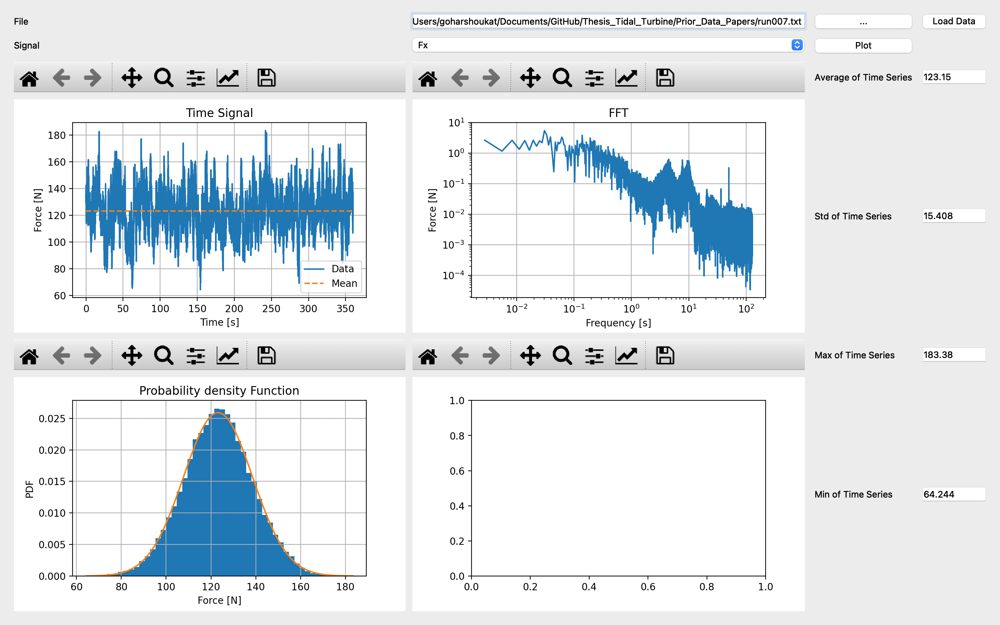

# Hydrodynamic Load Analysis of Tidal Turbines
This Repository hosts important functions for signal processing. It has 3 important files that are being used for data handling and visualisation:
* File named 'stats_lib' is a library of useful signal processing functions like fast fourier transforms, rolling averages and statistics. It also includes the option to plot the important figures and then subsequently save them. 
* Library named 'data_import_func' has functions to read text data files and import it as the Pandas data frame. It also provides additional functions that work in conjection with the functions in the library 'stats_lib' to perform the more vital data processing tasks. 
* The file named 'Dashboard' is as the name suggests, a dashboard used for ergonomic data handling and visualisation for on the spot data visualisation. It makes use of the previous two libraries to read data from files and plot them. 

The Dashboard is particularly useful for applications that involve live data handling and plotting. It provides users to conveniently visualise the results and make any changes if need be. The graphs can be conveniently adjusted to display any sort of information as the user may see fit. An image of the Version 0 is attached: 

